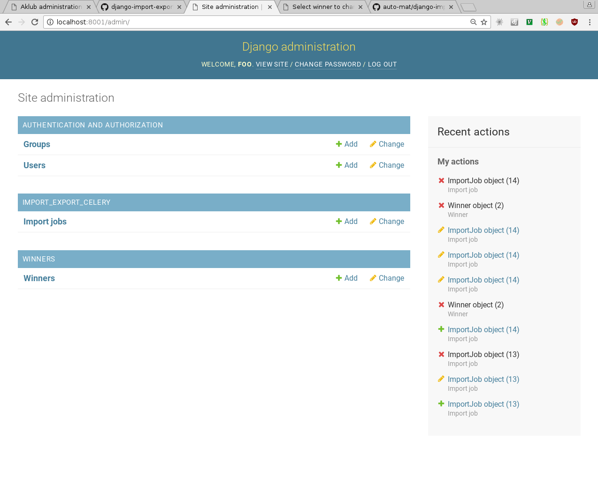
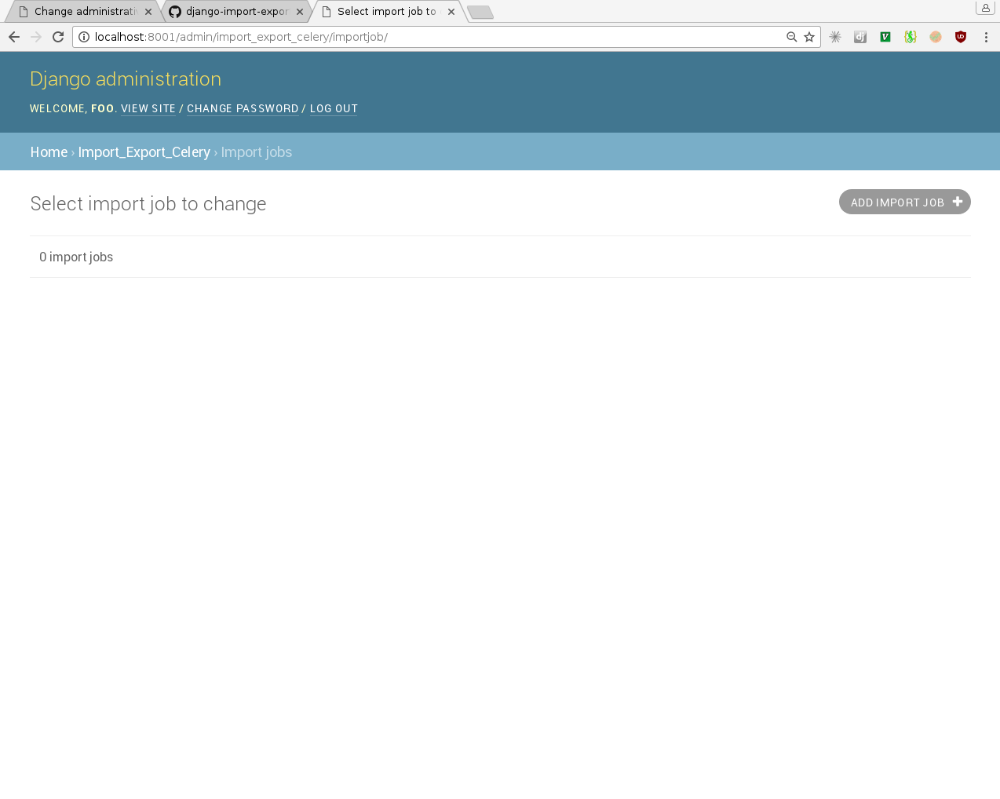
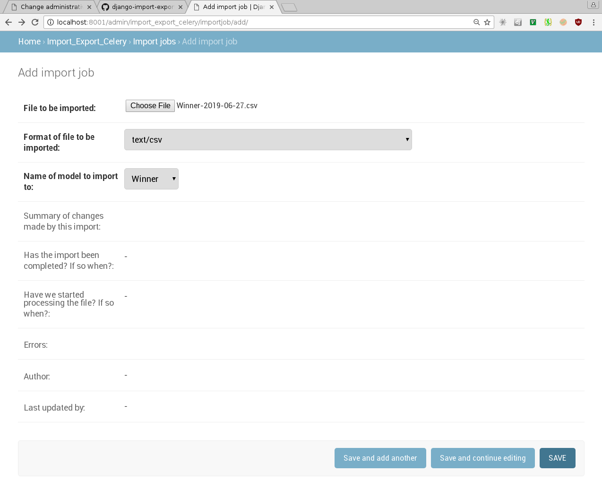
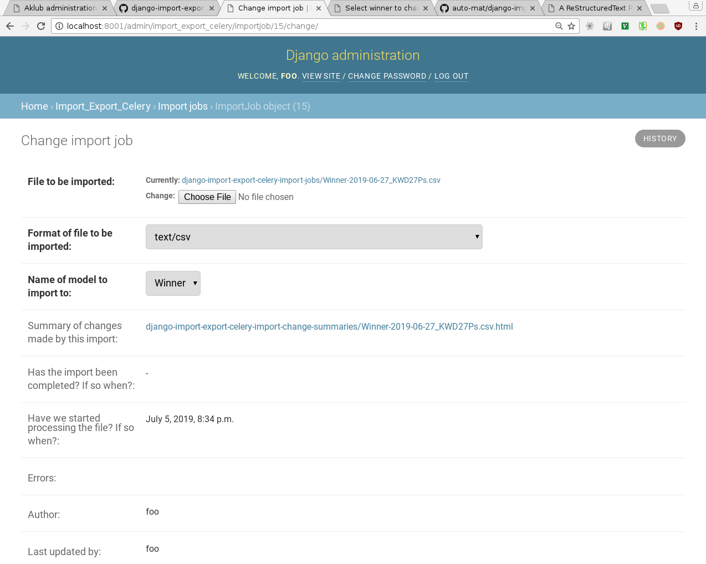
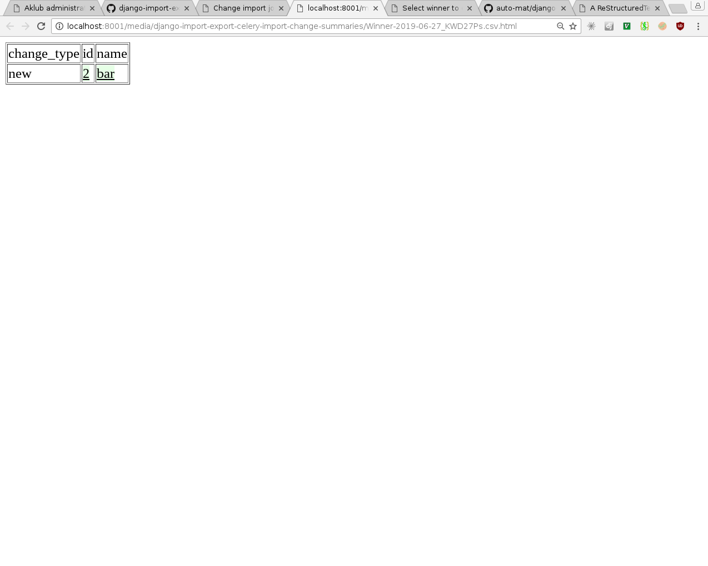
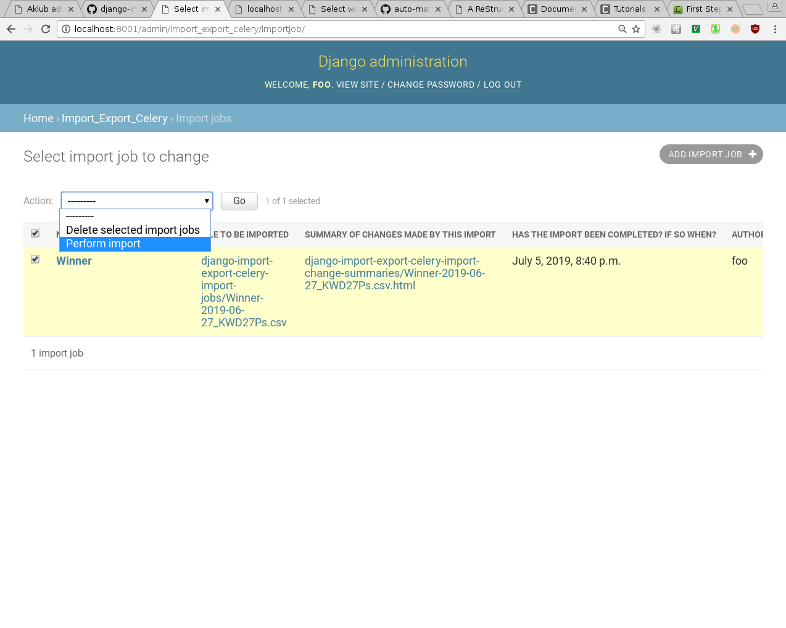
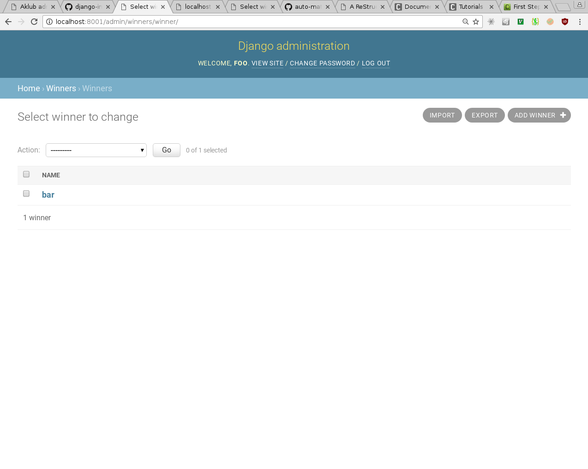

django-import-export-celery: process slow django imports and exports in celery
==============================================================================

django-import-export-celery helps you process long running imports in celery.

Setting up imports with celery
------------------------------

A fully configured example project can be found in the example directory of this repository.

1. `Set up celery <http://docs.celeryproject.org/en/latest/getting-started/first-steps-with-celery.html>`_ to work with your project.

2. Add 'import_export_celery' to your INSTALLED_APPS settings variable and configure the IMPORT_EXPORT_CELERY_MODELS variable.

::

    IMPORT_EXPORT_CELERY_MODELS = {
        "Winner": {'app_label': 'winners', 'model_name': 'Winner'}
    }

The available parameters are `app_label`, `model_name`, and `resource`.

3. Done

Preforming an import
--------------------

You will find an example django application that uses django-import-export-celery for importing data. There are instructions for running the example application in the example directory's README file. Once you have it running, you can perform an import with the following steps.

1. Navigate to the example applications admin page:

2. Navigate to the ImportJobs table:

3. Create a new import job. There is an example import CSV file in the example/example-data directory. Select that file. Select csv as the file format. We'll be importing to the Winner's model table. 

4. Select "Save and continue editing" to save the import job and refresh until you see that a "Summary of changes made by this import" file has been created.

5. You can view the summary if you want. Your import has NOT BEEN PERFORMED YET!

6. Return to the import-jobs table, select the import job we just created, and select the "Perform import" action from the actions drop down.

7. In a short time, your imported Winner object should show up in your Winners table.

Exports are not yet supported but they hopefully will be in a future release. PRs welcome.
